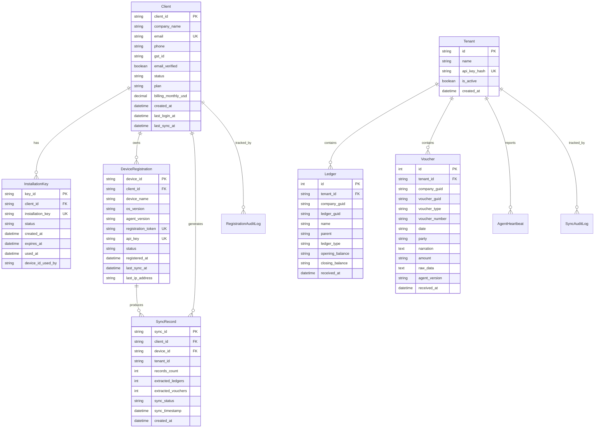
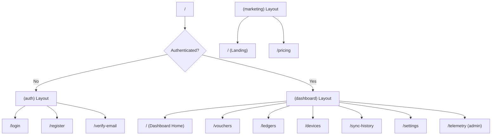
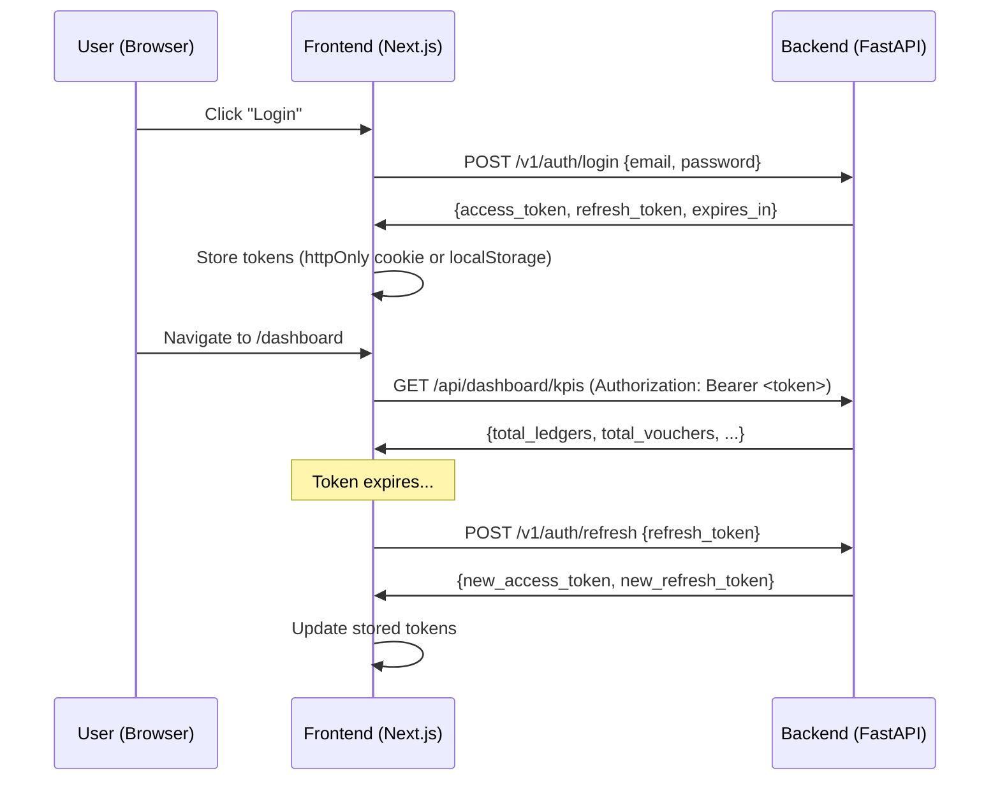

# Tally Sync Platform — Frontend Architecture Proposal

> **Version**: 1.0  
> **Date**: 2026-06-28  
> **Author**: Software Architecture Team  
> **Audience**: Frontend Coding Agent / Developer  
> **Status**: PROPOSED

---

## Table of Contents

1. [Executive Summary](#1-executive-summary)
2. [Backend Architecture Overview](#2-backend-architecture-overview)
3. [Complete API Reference](#3-complete-api-reference)
4. [Database Schema & Data Models](#4-database-schema--data-models)
5. [Recommended Technology Stack](#5-recommended-technology-stack)
6. [Frontend Architecture Design](#6-frontend-architecture-design)
7. [Page-by-Page Specifications](#7-page-by-page-specifications)
8. [Authentication & Authorization Flow](#8-authentication--authorization-flow)
9. [State Management Strategy](#9-state-management-strategy)
10. [Design System & UI Guidelines](#10-design-system--ui-guidelines)
11. [Implementation Roadmap](#11-implementation-roadmap)
12. [Existing Frontend Scaffold](#12-existing-frontend-scaffold)
13. [Appendix: API Payloads](#13-appendix-api-payloads)

---

## 1. Executive Summary

### What is Tally Sync Platform?

Tally Sync Platform is a **B2B SaaS product for Indian MSMEs** (Micro, Small & Medium Enterprises). It bridges Tally ERP 9/Prime desktop accounting software with a cloud backend, enabling:

1. **Real-time data sync** — A Windows agent extracts ledgers and vouchers from Tally and pushes them to the cloud.
2. **Multi-tenant data isolation** — Each MSME client's data is fully isolated via `tenant_id` and `client_id`.
3. **Fleet monitoring** — Track agent health, heartbeats, sync status, and telemetry across all client devices.
4. **Self-service onboarding** — Clients register → receive an installation key → install the agent → auto-provision credentials.

### What the Frontend Must Do

The frontend is a **web dashboard** that serves two distinct personas:

| Persona | Role | Primary Actions |
|---------|------|-----------------|
| **MSME Client (Admin/Finance)** | End user | View synced data, monitor sync health, manage devices, download agent |
| **Platform Operator** | Internal team | Monitor all tenants, view telemetry, manage client accounts |

### Key Constraints
- Target users are non-technical accountants and small business owners in India
- Must support Hindi/regional language data in voucher narrations and party names (UTF-8)
- Mobile-responsive is a MUST — many MSME owners check dashboards on mobile
- Must feel "premium" — this is a paid SaaS product, not an internal tool

---

## 2. Backend Architecture Overview

```
┌─────────────────────────────────────────────────────────────────┐
│                    CLOUD BACKEND (FastAPI)                       │
│                    EC2 Ubuntu + RDS PostgreSQL                   │
│                                                                 │
│  ┌──────────────┐  ┌──────────────┐  ┌──────────────────────┐  │
│  │ Auth Module   │  │ Keys Module  │  │ Registration Module  │  │
│  │ /v1/auth/*    │  │ /v1/devices/*│  │ /v1/register         │  │
│  │              │  │              │  │ /v1/register-device   │  │
│  │ • Register   │  │ • Register   │  │ /v1/clients/*/stats   │  │
│  │ • Login      │  │ • List       │  │ /v1/sync-with-client  │  │
│  │ • Verify     │  │ • Rotate Key │  │                       │  │
│  │ • Refresh    │  │ • Status     │  │                       │  │
│  │ • Me         │  │              │  │                       │  │
│  │ • Logout     │  │              │  │                       │  │
│  └──────────────┘  └──────────────┘  └──────────────────────┘  │
│                                                                 │
│  ┌──────────────┐  ┌──────────────┐  ┌──────────────────────┐  │
│  │ Ingest API   │  │ Dashboard API│  │ Telemetry API        │  │
│  │ /v1/ledgers  │  │ /api/dash/*  │  │ /v1/telemetry/*      │  │
│  │ /v1/vouchers │  │              │  │                       │  │
│  │ /v1/stats    │  │ • KPIs       │  │ • POST events        │  │
│  │ /health      │  │ • Vouchers   │  │ • GET events          │  │
│  │              │  │ • Cash Flow  │  │ • GET stats            │  │
│  │              │  │ • Config     │  │                       │  │
│  └──────────────┘  └──────────────┘  └──────────────────────┘  │
│                                                                 │
│  ┌──────────────────────────────────────────────────────────┐  │
│  │ Authorization (Cerbos RBAC)                               │  │
│  │ Roles: admin, finance, viewer, device                     │  │
│  │ Resources: ledger, voucher, device, client, sync_record   │  │
│  └──────────────────────────────────────────────────────────┘  │
└─────────────────────────────────────────────────────────────────┘

         ▲                                        ▲
         │ HTTPS (JWT Bearer)                     │ HTTPS (API Key)
         │                                        │
    ┌────┴────┐                            ┌──────┴──────┐
    │ Frontend│                            │ Tally Agent │
    │ (Web UI)│                            │ (Windows)   │
    └─────────┘                            └─────────────┘
```

### Backend Tech Stack
- **Framework**: FastAPI (Python 3.12)
- **Database**: PostgreSQL 15 (AWS RDS)
- **Auth**: JWT (PyJWT) with Supabase-style client
- **Authorization**: Cerbos RBAC (admin/finance/viewer/device roles)
- **Hosting**: AWS EC2 (Ubuntu 22.04) with RDS PostgreSQL
- **API Key Auth**: SHA-256 hashed keys for agent-to-cloud auth

---

## 3. Complete API Reference

### 3.1 Authentication (`/v1/auth/`)

| Method | Endpoint | Auth | Description |
|--------|----------|------|-------------|
| `POST` | `/v1/auth/register` | None | Register new MSME client |
| `POST` | `/v1/auth/verify-email` | None | Verify email with token |
| `POST` | `/v1/auth/login` | None | Login → JWT tokens |
| `POST` | `/v1/auth/logout` | Bearer JWT | Invalidate session |
| `POST` | `/v1/auth/refresh` | None (refresh token in body) | Refresh access token |
| `GET`  | `/v1/auth/me` | Bearer JWT | Get current user info |

**Registration Request:**
```json
{
  "company_name": "Sharma Traders Pvt Ltd",
  "email": "shreya@sharma.com",
  "phone": "+91-9876543210",
  "password": "SecurePass123"
}
```

**Login Response:**
```json
{
  "access_token": "eyJhbG...",
  "refresh_token": "eyJhbG...",
  "token_type": "bearer",
  "expires_in": 3600,
  "client_id": "uuid-string",
  "email": "shreya@sharma.com"
}
```

**Password Requirements:**
- Minimum 8 characters
- At least 1 uppercase letter
- At least 1 digit

---

### 3.2 Device Management (`/v1/devices/`)

| Method | Endpoint | Auth | Description |
|--------|----------|------|-------------|
| `POST` | `/v1/devices/register` | Bearer JWT | Register device with installation key |
| `GET`  | `/v1/devices/list` | Bearer JWT | List all client devices |
| `POST` | `/v1/devices/rotate-key` | Bearer JWT | Rotate device API key |
| `GET`  | `/v1/devices/status/{device_id}` | Bearer JWT | Get specific device status |

**Device Registration Request:**
```json
{
  "installation_key": "TSA-ABC123-DEF456-GHI789",
  "device_name": "OFFICE-PC-01",
  "os_version": "Windows 11",
  "agent_version": "0.4.0"
}
```

**Device List Response (each item):**
```json
{
  "device_id": "device_abc123...",
  "device_name": "OFFICE-PC-01",
  "status": "active",
  "registered_at": "2026-06-28T12:34:56Z",
  "last_sync_at": "2026-06-28T13:00:00Z",
  "last_ip": "192.168.1.100",
  "os_version": "Windows 11",
  "agent_version": "0.4.0"
}
```

---

### 3.3 Registration (Legacy/Portal) (`/v1/`)

| Method | Endpoint | Auth | Description |
|--------|----------|------|-------------|
| `POST` | `/v1/register` | None | Register client (generates installation key) |
| `POST` | `/v1/register-device` | None | Register device (agent calls during install) |
| `GET`  | `/v1/clients/{client_id}/stats` | API Key | Get client sync statistics |
| `POST` | `/v1/sync-with-client` | API Key | Receive sync data with client tagging |

**Client Stats Response:**
```json
{
  "client_id": "cli_abc123",
  "company_name": "Sharma Traders",
  "status": "active",
  "plan": "trial",
  "total_syncs": 5,
  "total_records": 3250,
  "total_ledgers": 750,
  "total_vouchers": 2500,
  "last_sync": "2026-06-28T06:00:00Z",
  "devices": [
    {
      "device_id": "dev_xyz",
      "device_name": "OFFICE-PC-01",
      "status": "active",
      "last_sync": "2026-06-28T06:00:00Z"
    }
  ]
}
```

---

### 3.4 Dashboard API (`/api/dashboard/`)

| Method | Endpoint | Auth | Description |
|--------|----------|------|-------------|
| `GET`  | `/api/dashboard/kpis` | API Key (`x-api-key`) | KPI metrics |
| `GET`  | `/api/dashboard/vouchers` | API Key (`x-api-key`) | Paginated vouchers |
| `GET`  | `/api/dashboard/cash-flow` | API Key (`x-api-key`) | Cash flow trend |
| `GET`  | `/api/dashboard/tenant-config` | API Key (`x-api-key`) | Tenant branding config |
| `GET`  | `/api/dashboard/health` | None | Dashboard health check |

**KPI Response:**
```json
{
  "total_ledgers": 234,
  "total_vouchers": 1589,
  "last_sync": "2026-06-28T10:15:00Z",
  "sync_health": "healthy",
  "recent_syncs": 42
}
```

**Vouchers Query Parameters:**
- `skip` (int, default 0) — Pagination offset
- `limit` (int, default 50, max 100) — Page size

**Cash Flow Query Parameters:**
- `period` (string: "daily" | "weekly" | "monthly", default "monthly")
- `months` (int, 1-12, default 6) — Number of periods

**Tenant Config Response:**
```json
{
  "id": "tenant-uuid",
  "name": "Sharma Traders",
  "logo": null,
  "primaryColor": "#0D9488",
  "accentColor": "#D97706"
}
```

---

### 3.5 Data Ingest (`/v1/` — Agent-facing)

| Method | Endpoint | Auth | Description |
|--------|----------|------|-------------|
| `POST` | `/v1/ledgers` | API Key (`x-api-key`) | Batch ingest ledgers |
| `POST` | `/v1/vouchers` | API Key (`x-api-key`) | Batch ingest vouchers |
| `GET`  | `/v1/stats` | API Key (`x-api-key`) | Get ingest stats |
| `GET`  | `/health` | None | Health check |

> **Note:** These endpoints are agent-facing (not directly used by frontend), but the data they ingest is displayed in the dashboard.

---

### 3.6 Telemetry (`/v1/telemetry/`)

| Method | Endpoint | Auth | Description |
|--------|----------|------|-------------|
| `POST` | `/v1/telemetry/events` | API Key (`x-api-key`) | Ingest telemetry batch |
| `GET`  | `/v1/telemetry/events` | None | Query events (filters) |
| `GET`  | `/v1/telemetry/stats` | None | Telemetry statistics |

**Telemetry Events Query Parameters:**
- `event_type` (string) — Filter by type
- `agent_id` (string) — Filter by agent
- `severity` (string) — Filter by severity
- `limit` (int, 1-1000, default 100) — Max results

**Telemetry Stats Response:**
```json
{
  "total_events": 1234,
  "by_event_type": { "sync_complete": 500, "error": 12, "heartbeat": 722 },
  "by_severity": { "info": 1180, "warning": 42, "error": 12 },
  "by_agent_id": { "agent_001": 600, "agent_002": 634 },
  "recent_errors": [...]
}
```

---

### 3.7 System Endpoints

| Method | Endpoint | Auth | Description |
|--------|----------|------|-------------|
| `GET`  | `/` | None | Root status (version info) |
| `GET`  | `/health` | None | Health check |
| `GET`  | `/api/dashboard/health` | None | Dashboard subsystem health |

---

## 4. Database Schema & Data Models

### 4.1 Entity Relationship Diagram



### 4.2 Key Data Relationships

| From → To | Relationship | Join Key |
|-----------|-------------|----------|
| Client → DeviceRegistration | 1:Many | `client_id` |
| Client → InstallationKey | 1:Many | `client_id` |
| Client → SyncRecord | 1:Many | `client_id` |
| DeviceRegistration → SyncRecord | 1:Many | `device_id` |
| Tenant → Ledger | 1:Many | `tenant_id` |
| Tenant → Voucher | 1:Many | `tenant_id` |

### 4.3 Voucher Types (Business Domain)

| Type | Description | Icon Suggestion |
|------|-------------|-----------------|
| `Sales` | Revenue transactions | 📤 ArrowUpRight |
| `Purchase` | Expense/procurement | 📥 ArrowDownLeft |
| `Receipt` | Cash/bank received | 💰 Banknote |
| `Payment` | Cash/bank paid out | 💸 CreditCard |
| `Journal` | Adjusting entries | 📋 FileText |
| `Debit Note` | Purchase returns | ↩️ RotateCcw |
| `Credit Note` | Sales returns | ↩️ RotateCw |

### 4.4 Status Enums

**Client Status:**
| Value | Description | UI Color |
|-------|-------------|----------|
| `pending_verification` | Email not verified | 🟡 Yellow |
| `active` | Fully operational | 🟢 Green |
| `suspended` | Temporarily disabled | 🔴 Red |
| `inactive` | Deactivated | ⚫ Gray |

**Device Status:**
| Value | Description | UI Color |
|-------|-------------|----------|
| `active` | Connected and syncing | 🟢 Green |
| `inactive` | Stopped syncing | 🟡 Yellow |
| `revoked` | Access revoked | 🔴 Red |

**Sync Health:**
| Value | Rule | UI Treatment |
|-------|------|--------------|
| `healthy` | Last sync < 24 hours | Green pulse dot |
| `warning` | Last sync 1–7 days ago | Amber blinking dot |
| `error` | No sync or > 7 days | Red static dot |

**Plan Types:**
| Value | Description |
|-------|-------------|
| `trial` | 14-day free trial |
| `basic` | Basic plan |
| `professional` | Full-feature plan |

---

## 5. Recommended Technology Stack

### 5.1 Framework Decision Matrix

| Criterion | Next.js (App Router) | Vite + React | Remix | Astro |
|-----------|---------------------|-------------|-------|-------|
| SSR/SSG Support | ✅ Excellent | ❌ CSR only | ✅ Good | ✅ Excellent |
| Auth Flow (JWT) | ✅ Middleware | ⚠️ Manual | ✅ Loaders | ⚠️ Manual |
| SEO (Landing Page) | ✅ Built-in | ❌ Needs SSR lib | ✅ Built-in | ✅ Excellent |
| Dashboard Performance | ✅ Client components | ✅ Fast HMR | ✅ Good | ⚠️ Not ideal |
| Indian MSME CDN | ✅ Vercel Edge India | ⚠️ Manual CDN | ⚠️ Fly.io | ⚠️ Manual |
| TypeScript | ✅ First-class | ✅ First-class | ✅ First-class | ✅ First-class |
| Community & Hiring | ✅ Largest | ✅ Large | ⚠️ Smaller | ⚠️ Smaller |
| **Score** | **9/10** | **7/10** | **7/10** | **5/10** |

### 5.2 Recommended Stack

> **⚡ RECOMMENDED: Next.js 16 (App Router) + Tailwind CSS v4 + shadcn/ui**

```
┌─────────────────────────────────────────────────────┐
│                   FRONTEND STACK                     │
│                                                     │
│  Framework:     Next.js 16 (App Router)             │
│  Language:      TypeScript 5.x                      │
│  Styling:       Tailwind CSS v4                     │
│  Components:    shadcn/ui (Radix primitives)        │
│  Charts:        Recharts 3.x                        │
│  Tables:        @tanstack/react-table 8.x           │
│  Data Fetching: @tanstack/react-query 5.x           │
│  HTTP Client:   Axios 1.x                           │
│  Forms:         react-hook-form 7.x + Zod 4.x      │
│  Icons:         Lucide React                        │
│  State:         Zustand 5.x (client state)          │
│  Date/Time:     date-fns 4.x                        │
│  CSS Utils:     clsx + tailwind-merge               │
│  Testing:       Vitest + Testing Library             │
│  Deployment:    Vercel or self-hosted (Docker)       │
└─────────────────────────────────────────────────────┘
```

> **Note:** An existing `frontend/` scaffold already exists in the repo with these exact dependencies already installed. See [Section 12](#12-existing-frontend-scaffold) for details.

### 5.3 Why shadcn/ui Over Alternatives

| Component Library | Pros | Cons | Verdict |
|-------------------|------|------|---------|
| **shadcn/ui** | Copy-paste ownership, Radix accessibility, Tailwind native, highly customizable | Must install components individually | ✅ **Best Fit** |
| Material UI (MUI) | Comprehensive, Google design | Heavy bundle, complex theming, opinionated | ❌ Too heavy for MSME context |
| Ant Design | Great data tables, enterprise feel | Chinese-centric docs, large bundle | ❌ Bundle size concern |
| Chakra UI | Simple API, good defaults | Limited advanced components | ⚠️ Acceptable but less polished |
| Mantine | Modern, great hooks | Smaller ecosystem | ⚠️ Good but less ecosystem support |

### 5.4 Why NOT a Pre-built Admin Template

Pre-built admin templates (AdminLTE, CoreUI, etc.) seem faster initially but create long-term problems:
1. **Locked to their design system** — hard to match your brand identity
2. **Vendor lock-in** — upgrading framework versions is painful
3. **Unused bloat** — 80% of template components go unused
4. **Customization friction** — overriding deeply nested styles is harder than building from scratch

With **shadcn/ui**, you get a component catalog where you only install what you need, and you *own the code* — it copies into your project as plain React components you can modify freely.

---

## 6. Frontend Architecture Design

### 6.1 Directory Structure

```
frontend/
├── src/
│   ├── app/                          # Next.js App Router
│   │   ├── (auth)/                   # Auth layout group (no sidebar)
│   │   │   ├── login/page.tsx
│   │   │   ├── register/page.tsx
│   │   │   ├── verify-email/page.tsx
│   │   │   └── layout.tsx            # Minimal centered layout
│   │   │
│   │   ├── (dashboard)/              # Dashboard layout group (with sidebar)
│   │   │   ├── layout.tsx            # Sidebar + Header + Main
│   │   │   ├── page.tsx              # Dashboard home (KPIs)
│   │   │   ├── vouchers/page.tsx     # Voucher table (paginated)
│   │   │   ├── ledgers/page.tsx      # Ledger browser
│   │   │   ├── devices/page.tsx      # Device fleet management
│   │   │   ├── sync-history/page.tsx # Sync audit trail
│   │   │   ├── settings/page.tsx     # Account settings
│   │   │   └── telemetry/page.tsx    # Agent telemetry (admin only)
│   │   │
│   │   ├── (marketing)/              # Public pages (SSR, SEO-optimized)
│   │   │   ├── page.tsx              # Landing page
│   │   │   ├── pricing/page.tsx
│   │   │   └── layout.tsx
│   │   │
│   │   ├── layout.tsx                # Root layout (providers)
│   │   └── globals.css               # Tailwind + custom CSS vars
│   │
│   ├── components/
│   │   ├── ui/                       # shadcn/ui components
│   │   │   ├── button.tsx
│   │   │   ├── card.tsx
│   │   │   ├── dialog.tsx
│   │   │   ├── dropdown-menu.tsx
│   │   │   ├── input.tsx
│   │   │   ├── badge.tsx
│   │   │   ├── skeleton.tsx
│   │   │   ├── table.tsx
│   │   │   ├── toast.tsx
│   │   │   └── ...
│   │   │
│   │   ├── layout/
│   │   │   ├── Sidebar.tsx           # Collapsible sidebar navigation
│   │   │   ├── Header.tsx            # Top bar (search, user menu)
│   │   │   ├── Footer.tsx
│   │   │   └── MobileNav.tsx         # Mobile hamburger menu
│   │   │
│   │   ├── dashboard/
│   │   │   ├── KPICards.tsx          # KPI metric cards
│   │   │   ├── SyncHealthIndicator.tsx
│   │   │   ├── RecentVouchersTable.tsx
│   │   │   ├── CashFlowChart.tsx
│   │   │   └── ActivityFeed.tsx
│   │   │
│   │   ├── devices/
│   │   │   ├── DeviceCard.tsx
│   │   │   ├── DeviceRegistrationDialog.tsx
│   │   │   └── KeyRotationDialog.tsx
│   │   │
│   │   ├── auth/
│   │   │   ├── LoginForm.tsx
│   │   │   ├── RegisterForm.tsx
│   │   │   └── ProtectedRoute.tsx
│   │   │
│   │   └── shared/
│   │       ├── EmptyState.tsx
│   │       ├── ErrorBoundary.tsx
│   │       ├── LoadingSkeleton.tsx
│   │       └── StatusBadge.tsx
│   │
│   ├── lib/
│   │   ├── api/
│   │   │   ├── client.ts             # Axios instance with interceptors
│   │   │   ├── auth.ts               # Auth API calls
│   │   │   ├── dashboard.ts          # Dashboard API calls
│   │   │   ├── devices.ts            # Device API calls
│   │   │   ├── telemetry.ts          # Telemetry API calls
│   │   │   └── registration.ts       # Registration API calls
│   │   │
│   │   ├── hooks/
│   │   │   ├── useAuth.ts            # Auth state hook
│   │   │   ├── useKPIs.ts            # Dashboard KPIs hook
│   │   │   ├── useVouchers.ts        # Paginated vouchers hook
│   │   │   ├── useDevices.ts         # Device list hook
│   │   │   └── useSyncHealth.ts      # Sync health polling hook
│   │   │
│   │   ├── stores/
│   │   │   ├── authStore.ts          # Zustand auth store
│   │   │   └── uiStore.ts            # UI state (sidebar, theme)
│   │   │
│   │   └── utils/
│   │       ├── formatters.ts         # Currency, date formatting
│   │       ├── constants.ts          # API URLs, enums
│   │       └── cn.ts                 # clsx + tailwind-merge
│   │
│   └── types/
│       ├── api.ts                    # API response types
│       ├── models.ts                 # Domain model types
│       └── auth.ts                   # Auth types
│
├── public/
│   ├── logo.svg
│   └── favicon.ico
│
├── next.config.ts
├── tailwind.config.ts               # (if needed; Tailwind v4 uses CSS config)
├── tsconfig.json
└── package.json
```

### 6.2 Route Architecture



---

## 7. Page-by-Page Specifications

### 7.1 Login Page (`/login`)

**Purpose:** Authenticate existing clients

**UI Elements:**
- Company logo + branding
- Email + Password fields
- "Remember me" checkbox
- "Forgot password?" link
- "Don't have an account? Register" link
- Social proof strip ("500+ MSMEs trust us")

**API Calls:**
- `POST /v1/auth/login` → returns `access_token`, `refresh_token`

**UX Notes:**
- Auto-focus email field on load
- Show/hide password toggle
- Inline validation (email format, min 8 chars password)
- On success → redirect to `/` (dashboard)
- On failure → shake animation + red error message

---

### 7.2 Registration Page (`/register`)

**Purpose:** Onboard new MSME client

**UI Elements:**
- Multi-step form (2 steps):
  1. **Step 1**: Company Name, Email, Phone
  2. **Step 2**: Password, Confirm Password, GST ID (optional)
- Progress indicator (Step 1 of 2, Step 2 of 2)
- Terms & Conditions checkbox

**API Calls:**
- `POST /v1/auth/register`

**UX Notes:**
- Inline validation for email uniqueness (debounced check)
- Password strength meter
- GST ID format validation (15-char alphanumeric)
- On success → show "Check your email for verification" screen

---

### 7.3 Dashboard Home (`/`)

**Purpose:** At-a-glance overview of sync status and key metrics

**Layout:**
```
┌──────────────────────────────────────────────────────┐
│  HEADER: Company Name | Search | Notifications | 👤  │
├────────┬─────────────────────────────────────────────┤
│        │                                             │
│  SIDE  │  ┌────────┐ ┌────────┐ ┌────────┐ ┌─────┐ │
│  BAR   │  │Ledgers │ │Vouchers│ │Sync    │ │Last │ │
│        │  │  234   │ │ 1,589  │ │Health  │ │Sync │ │
│  📊    │  │  ↑12%  │ │  ↑8%   │ │🟢 OK   │ │2h   │ │
│  Home  │  └────────┘ └────────┘ └────────┘ └─────┘ │
│        │                                             │
│  📋    │  ┌──────────────────────────────────────┐  │
│  Vouch │  │  Cash Flow Trend (Recharts Area)      │  │
│        │  │  ▁▂▃▅▆▇█▇▆▅                           │  │
│  📖    │  │  Jan  Feb  Mar  Apr  May  Jun         │  │
│  Ledger│  └──────────────────────────────────────┘  │
│        │                                             │
│  🖥️    │  ┌──────────────────────────────────────┐  │
│  Device│  │  Recent Vouchers (Last 10)            │  │
│        │  │  ┌────┬──────┬───────┬─────┬───────┐ │  │
│  📡    │  │  │ #  │ Date │ Party │ Amt │ Type  │ │  │
│  Sync  │  │  ├────┼──────┼───────┼─────┼───────┤ │  │
│        │  │  │ 1  │06-28 │Raj.. │₹12k │ Sales │ │  │
│  ⚙️    │  │  │ 2  │06-27 │Pra.. │₹8k  │Purch. │ │  │
│  Sett. │  │  └────┴──────┴───────┴─────┴───────┘ │  │
│        │  └──────────────────────────────────────┘  │
└────────┴─────────────────────────────────────────────┘
```

**API Calls:**
- `GET /api/dashboard/kpis` → KPI cards
- `GET /api/dashboard/vouchers?limit=10` → Recent vouchers
- `GET /api/dashboard/cash-flow?months=6` → Chart data
- `GET /api/dashboard/tenant-config` → Branding

**Polling Strategy:**
- KPIs: Refresh every 60 seconds (`refetchInterval: 60000`)
- Sync health: Refresh every 30 seconds
- Vouchers: Refresh on window focus

---

### 7.4 Vouchers Page (`/vouchers`)

**Purpose:** Browse, filter, and search all synced vouchers

**UI Elements:**
- **Filters Bar**: Voucher type dropdown, Date range picker, Party search
- **Data Table**: Paginated, sortable, with column resizing
- **Columns**: Voucher #, Date, Party, Amount, Type, Narration (truncated)
- **Expandable Rows**: Click to see full narration + raw data
- **Export**: CSV download button

**API Calls:**
- `GET /api/dashboard/vouchers?skip={n}&limit=50`

**Table Features:**
- Server-side pagination (backend already supports `skip`/`limit`)
- Client-side column sorting
- Type filter badges (colored by voucher type)
- Amount formatting with ₹ symbol and Indian comma notation (1,00,000)

---

### 7.5 Ledgers Page (`/ledgers`)

**Purpose:** Browse chart of accounts (ledger master data)

**UI Elements:**
- **Tree View**: Hierarchical display using `parent` field
- **Search**: Filter by ledger name
- **Type Filter**: Filter by `ledger_type`
- **Balance Display**: Opening and closing balances

**API Calls:**
- Needs a new endpoint: `GET /api/dashboard/ledgers?skip=0&limit=100`
  - (Currently doesn't exist — agent should create it following the vouchers pattern)

> **⚠️ IMPORTANT**: The backend currently has no paginated ledger endpoint for the dashboard. You will need to create `GET /api/dashboard/ledgers` following the same pattern as `/api/dashboard/vouchers`.

---

### 7.6 Devices Page (`/devices`)

**Purpose:** Fleet management — view and manage agent devices

**UI Elements:**
- **Device Cards** (grid layout):
  - Device name, OS version, agent version
  - Status badge (active/inactive/revoked)
  - Last sync timestamp with relative time ("2 hours ago")
  - Last IP address
- **Actions per device**:
  - Rotate API Key (confirmation dialog)
  - View detailed status
  - Copy device ID
- **"Register New Device" Button** → opens dialog showing installation key

**API Calls:**
- `GET /v1/devices/list` → Device list
- `GET /v1/devices/status/{device_id}` → Device details
- `POST /v1/devices/rotate-key?device_id=xxx` → Key rotation
- `POST /v1/devices/register` → New device registration

---

### 7.7 Sync History Page (`/sync-history`)

**Purpose:** Audit trail of all sync operations

**UI Elements:**
- **Timeline/Table view toggle**
- **Columns**: Sync ID, Device, Timestamp, Ledgers synced, Vouchers synced, Status
- **Filters**: Date range, Device, Status (success/partial/failed)

**API Calls:**
- `GET /v1/clients/{client_id}/stats` → Overall stats
- Needs: `GET /v1/sync-records?client_id=xxx&skip=0&limit=50` (new endpoint needed)

> **⚠️ IMPORTANT**: The backend needs a paginated sync records endpoint. Follow the existing pattern.

---

### 7.8 Settings Page (`/settings`)

**Purpose:** Account management

**Tabs:**
1. **Profile**: Company name, email (read-only), phone, GST ID
2. **Plan & Billing**: Current plan, upgrade options, usage stats
3. **Security**: Change password, view active sessions
4. **Installation Keys**: Generate new installation keys for additional devices

**API Calls:**
- `GET /v1/auth/me` → Current user info
- Needs: `PUT /v1/auth/profile` (update profile — new endpoint)

---

### 7.9 Telemetry Page (`/telemetry`) — Admin Only

**Purpose:** Monitor agent fleet health (platform operator view)

**UI Elements:**
- **Stats Cards**: Total events, by severity, by event type
- **Error Feed**: Real-time list of recent errors/warnings
- **Agent Selector**: Filter by specific agent
- **Charts**: Events over time, severity distribution (pie chart)

**API Calls:**
- `GET /v1/telemetry/stats` → Statistics
- `GET /v1/telemetry/events?severity=error&limit=50` → Error feed

---

## 8. Authentication & Authorization Flow

### 8.1 JWT Token Flow



### 8.2 Token Storage Strategy

```typescript
// Recommended: Zustand store + localStorage persistence
// File: src/lib/stores/authStore.ts

import { create } from 'zustand';
import { persist } from 'zustand/middleware';

interface AuthState {
  accessToken: string | null;
  refreshToken: string | null;
  clientId: string | null;
  email: string | null;
  companyName: string | null;
  isAuthenticated: boolean;
  
  login: (tokens: LoginResponse) => void;
  logout: () => void;
  setTokens: (access: string, refresh: string) => void;
}

export const useAuthStore = create<AuthState>()(
  persist(
    (set) => ({
      accessToken: null,
      refreshToken: null,
      clientId: null,
      email: null,
      companyName: null,
      isAuthenticated: false,
      
      login: (data) => set({
        accessToken: data.access_token,
        refreshToken: data.refresh_token,
        clientId: data.client_id,
        email: data.email,
        isAuthenticated: true,
      }),
      
      logout: () => set({
        accessToken: null,
        refreshToken: null,
        clientId: null,
        email: null,
        isAuthenticated: false,
      }),
      
      setTokens: (access, refresh) => set({
        accessToken: access,
        refreshToken: refresh,
      }),
    }),
    { name: 'tally-sync-auth' }
  )
);
```

### 8.3 Axios Interceptor (Auto-refresh)

```typescript
// File: src/lib/api/client.ts

import axios from 'axios';
import { useAuthStore } from '../stores/authStore';

const API_BASE = process.env.NEXT_PUBLIC_API_URL || 'http://localhost:8000';

const apiClient = axios.create({
  baseURL: API_BASE,
  timeout: 30000,
  headers: { 'Content-Type': 'application/json' },
});

// Request interceptor: attach Bearer token
apiClient.interceptors.request.use((config) => {
  const { accessToken } = useAuthStore.getState();
  if (accessToken) {
    config.headers.Authorization = `Bearer ${accessToken}`;
  }
  return config;
});

// Response interceptor: auto-refresh on 401
apiClient.interceptors.response.use(
  (response) => response,
  async (error) => {
    const originalRequest = error.config;
    
    if (error.response?.status === 401 && !originalRequest._retry) {
      originalRequest._retry = true;
      
      const { refreshToken, setTokens, logout } = useAuthStore.getState();
      
      if (!refreshToken) {
        logout();
        window.location.href = '/login';
        return Promise.reject(error);
      }
      
      try {
        const { data } = await axios.post(`${API_BASE}/v1/auth/refresh`, {
          refresh_token: refreshToken,
        });
        
        setTokens(data.access_token, data.refresh_token);
        originalRequest.headers.Authorization = `Bearer ${data.access_token}`;
        return apiClient(originalRequest);
      } catch {
        logout();
        window.location.href = '/login';
      }
    }
    
    return Promise.reject(error);
  }
);

export default apiClient;
```

### 8.4 RBAC in Frontend

The backend has 4 roles: `admin`, `finance`, `viewer`, `device`.

```typescript
// Role-based UI visibility
const ROLE_PERMISSIONS = {
  admin: ['dashboard', 'vouchers', 'ledgers', 'devices', 'settings', 'telemetry', 'sync-history'],
  finance: ['dashboard', 'vouchers', 'ledgers', 'devices', 'sync-history'],
  viewer: ['dashboard', 'vouchers', 'ledgers'],
  device: [], // No web UI access
} as const;
```

The sidebar and route guards should check the user's role and show/hide navigation items accordingly.

---

## 9. State Management Strategy

### 9.1 State Layer Separation

| State Type | Tool | Why |
|-----------|------|-----|
| **Server State** (API data) | TanStack React Query | Caching, background refetch, pagination, stale-while-revalidate |
| **Auth State** (tokens, user) | Zustand + persist | Survives page refresh, simple API |
| **UI State** (sidebar, theme) | Zustand (no persist) | Lightweight, reactive |
| **Form State** | react-hook-form + Zod | Validation, error handling |
| **URL State** (filters, page) | Next.js `useSearchParams` | Shareable URLs, bookmarkable filters |

### 9.2 React Query Patterns

```typescript
// File: src/lib/hooks/useKPIs.ts

import { useQuery } from '@tanstack/react-query';
import apiClient from '../api/client';
import type { KPIData } from '@/types/api';

export function useKPIs() {
  return useQuery<KPIData>({
    queryKey: ['dashboard', 'kpis'],
    queryFn: async () => {
      const { data } = await apiClient.get('/api/dashboard/kpis');
      return data;
    },
    refetchInterval: 60_000, // Auto-refresh every 60 seconds
    staleTime: 30_000,       // Consider fresh for 30 seconds
  });
}
```

```typescript
// File: src/lib/hooks/useVouchers.ts

import { useQuery, keepPreviousData } from '@tanstack/react-query';
import apiClient from '../api/client';
import type { VouchersResponse } from '@/types/api';

export function useVouchers(skip: number, limit: number = 50) {
  return useQuery<VouchersResponse>({
    queryKey: ['dashboard', 'vouchers', { skip, limit }],
    queryFn: async () => {
      const { data } = await apiClient.get('/api/dashboard/vouchers', {
        params: { skip, limit },
      });
      return data;
    },
    placeholderData: keepPreviousData, // Keep old data visible during page transitions
  });
}
```

---

## 10. Design System & UI Guidelines

### 10.1 Color Palette

```css
/* Indian FinTech Inspired — Professional yet warm */
:root {
  /* Primary — Teal (trust, finance, growth) */
  --primary-50:  #f0fdfa;
  --primary-100: #ccfbf1;
  --primary-500: #14b8a6;
  --primary-600: #0d9488;
  --primary-700: #0f766e;
  --primary-900: #134e4a;
  
  /* Accent — Amber (warmth, attention, Indian aesthetic) */
  --accent-400: #fbbf24;
  --accent-500: #f59e0b;
  --accent-600: #d97706;
  
  /* Neutrals — Slate (clean, professional) */
  --neutral-50:  #f8fafc;
  --neutral-100: #f1f5f9;
  --neutral-200: #e2e8f0;
  --neutral-400: #94a3b8;
  --neutral-600: #475569;
  --neutral-800: #1e293b;
  --neutral-900: #0f172a;
  
  /* Semantic */
  --success: #22c55e;
  --warning: #f59e0b;
  --error:   #ef4444;
  --info:    #3b82f6;
  
  /* Background */
  --bg-app:     #f8fafc;  /* Light mode background */
  --bg-card:    #ffffff;
  --bg-sidebar: #0f172a;  /* Dark sidebar */
}

/* Dark mode */
[data-theme="dark"] {
  --bg-app:     #0f172a;
  --bg-card:    #1e293b;
  --bg-sidebar: #020617;
}
```

### 10.2 Typography

```css
/* Use Inter for UI, Outfit for headings */
@import url('https://fonts.googleapis.com/css2?family=Inter:wght@400;500;600;700&family=Outfit:wght@600;700;800&display=swap');

:root {
  --font-sans: 'Inter', system-ui, -apple-system, sans-serif;
  --font-heading: 'Outfit', 'Inter', system-ui, sans-serif;
  --font-mono: 'JetBrains Mono', 'Fira Code', monospace;
}
```

### 10.3 Component Specifications

**KPI Card:**
```
┌─────────────────────────┐
│  📊 Total Vouchers      │  ← Muted label + icon
│                         │
│  1,589                  │  ← Large number (Outfit 800, 2.5rem)
│  ↑ 12% vs last month   │  ← Trend indicator (green/red)
│                         │
│  ▁▂▃▅▆▇█▇▆ (sparkline) │  ← Mini sparkline chart
└─────────────────────────┘
   Subtle gradient border
   Hover: slight lift (translateY -2px)
   Shadow: 0 1px 3px rgba(0,0,0,0.08)
```

**Sync Health Indicator:**
```
  🟢 Healthy  ← Green pulsing dot + label
  🟡 Warning  ← Amber blinking dot + "Last sync 3 days ago"
  🔴 Error    ← Red static dot + "No recent sync detected"
```

### 10.4 Indian Number Formatting

```typescript
// CRITICAL for Indian MSME users
// Indian numbering: 1,00,000 (not 100,000)

export function formatINR(amount: string | number): string {
  const num = typeof amount === 'string' ? parseFloat(amount.replace(/,/g, '')) : amount;
  if (isNaN(num)) return '₹0';
  
  return new Intl.NumberFormat('en-IN', {
    style: 'currency',
    currency: 'INR',
    maximumFractionDigits: 0,
  }).format(num);
}

// formatINR(100000)  → "₹1,00,000"
// formatINR(1234567) → "₹12,34,567"
```

### 10.5 Responsive Breakpoints

| Breakpoint | Width | Layout |
|------------|-------|--------|
| Mobile | < 640px | Single column, bottom nav |
| Tablet | 640px – 1024px | Collapsible sidebar |
| Desktop | > 1024px | Fixed sidebar + content |

### 10.6 Animations

```css
/* Micro-interactions */
.card-hover {
  transition: transform 0.2s ease, box-shadow 0.2s ease;
}
.card-hover:hover {
  transform: translateY(-2px);
  box-shadow: 0 8px 30px rgba(0, 0, 0, 0.08);
}

/* Sync pulse */
@keyframes pulse-sync {
  0%, 100% { opacity: 1; }
  50% { opacity: 0.5; }
}
.sync-healthy { animation: pulse-sync 2s ease-in-out infinite; }

/* Page transitions */
.page-enter {
  animation: fadeSlideIn 0.3s ease-out;
}
@keyframes fadeSlideIn {
  from { opacity: 0; transform: translateY(8px); }
  to   { opacity: 1; transform: translateY(0); }
}
```

---

## 11. Implementation Roadmap

### Phase 1: Foundation (Days 1–3)

| Task | Priority | Details |
|------|----------|---------|
| Initialize shadcn/ui in existing Next.js project | P0 | `npx shadcn@latest init` |
| Install core shadcn components | P0 | button, card, input, badge, skeleton, table, dialog, dropdown-menu, toast, sheet |
| Create design system tokens | P0 | Colors, typography, spacing in `globals.css` |
| Create layout components | P0 | Sidebar, Header, MobileNav |
| Setup API client with interceptors | P0 | Axios + auth store |
| Create auth store (Zustand) | P0 | Login, logout, token refresh |

### Phase 2: Auth & Onboarding (Days 3–5)

| Task | Priority | Details |
|------|----------|---------|
| Login page | P0 | Email + Password form |
| Registration page | P0 | Multi-step form |
| Email verification page | P1 | Token verification |
| Protected route middleware | P0 | Next.js middleware for `/` routes |
| Auth hooks | P0 | `useAuth`, token refresh logic |

### Phase 3: Dashboard Core (Days 5–8)

| Task | Priority | Details |
|------|----------|---------|
| KPI cards | P0 | 4 metric cards with sparklines |
| Cash flow chart | P0 | Recharts area chart |
| Recent vouchers table | P0 | Last 10 vouchers |
| Sync health indicator | P0 | Pulsing status dot |
| Auto-refresh (polling) | P1 | 60-second KPI refresh |

### Phase 4: Data Pages (Days 8–12)

| Task | Priority | Details |
|------|----------|---------|
| Vouchers table (full page) | P0 | Paginated, filtered, searchable |
| Ledgers browser | P1 | Hierarchical tree view |
| Devices fleet management | P1 | Device cards + actions |
| Sync history timeline | P2 | Audit trail table |

### Phase 5: Settings & Polish (Days 12–15)

| Task | Priority | Details |
|------|----------|---------|
| Settings page | P1 | Profile, plan, security tabs |
| Telemetry dashboard | P2 | Admin-only page |
| Dark mode toggle | P1 | CSS variables + Zustand |
| Mobile responsiveness | P0 | All pages mobile-friendly |
| Error boundaries + empty states | P1 | Graceful error handling |
| Loading skeletons | P1 | Shimmer loading states |

### Phase 6: Landing & Marketing (Optional — Days 15+)

| Task | Priority | Details |
|------|----------|---------|
| Landing page | P2 | Public SSR page |
| Pricing page | P2 | Plan comparison |
| Download agent page | P2 | Agent installer download |

---

## 12. Existing Frontend Scaffold

### What Already Exists

The project already has a `frontend/` directory with a Next.js 16 project initialized:

**Location:** `d:\tally-shayak\frontend\`

**Installed Dependencies (already in `package.json`):**
- `next` 16.2.9, `react` 19.2.4
- `@tanstack/react-query` 5.x
- `@tanstack/react-table` 8.x
- `recharts` 3.x
- `axios` 1.x
- `react-hook-form` 7.x + `zod` 4.x
- `lucide-react` 1.x
- `zustand` 5.x
- `tailwindcss` v4 + `@tailwindcss/postcss`
- `clsx` + `tailwind-merge`

**Existing Components:**
| File | Description | Status |
|------|-------------|--------|
| `src/components/Dashboard.tsx` | Basic dashboard layout | ⚠️ Scaffold only |
| `src/components/ui/card.tsx` | Card component | ⚠️ Basic |
| `src/components/widgets/KPIWidget.tsx` | KPI metric widget | ⚠️ Basic |
| `src/components/widgets/CashFlowChartWidget.tsx` | Cash flow chart | ⚠️ Basic |
| `src/components/widgets/VouchersTableWidget.tsx` | Vouchers table | ⚠️ Basic |

**Recommendation:** These existing components are functional scaffolds but need significant enhancement for production quality. You should:
1. Keep the existing project structure
2. Initialize shadcn/ui (will add proper UI primitives)
3. Rebuild the widgets with the proper design system
4. Add the missing pages (auth, devices, settings, etc.)

---

## 13. Appendix: API Payloads

### A. Complete TypeScript Types

```typescript
// File: src/types/api.ts

// ─── Auth ────────────────────────────────────────────

export interface LoginRequest {
  email: string;
  password: string;
}

export interface RegisterRequest {
  company_name: string;
  email: string;
  phone: string;
  password: string;
}

export interface LoginResponse {
  access_token: string;
  refresh_token: string;
  token_type: 'bearer';
  expires_in: number;
  client_id: string;
  email: string;
}

export interface UserInfo {
  client_id: string;
  company_name: string;
  email: string;
  phone: string | null;
  status: ClientStatus;
  email_verified: boolean;
  created_at: string;
  last_login_at: string | null;
}

// ─── Dashboard ───────────────────────────────────────

export interface KPIData {
  total_ledgers: number;
  total_vouchers: number;
  last_sync: string | null;
  sync_health: SyncHealth;
  recent_syncs: number;
}

export interface VoucherDTO {
  id: number;
  voucher_number: string | null;
  date: string; // YYYY-MM-DD
  party: string | null;
  amount: string | null;
  type: VoucherType;
}

export interface VouchersResponse {
  data: VoucherDTO[];
  total: number;
  skip: number;
  limit: number;
}

export interface CashFlowData {
  month: string; // YYYY-MM
  amount: number;
}

export interface TenantConfig {
  id: string;
  name: string;
  logo: string | null;
  primaryColor: string;
  accentColor: string;
}

// ─── Devices ─────────────────────────────────────────

export interface DeviceInfo {
  device_id: string;
  device_name: string;
  status: DeviceStatus;
  registered_at: string;
  last_sync_at: string | null;
  last_ip: string | null;
  os_version: string | null;
  agent_version: string | null;
}

export interface DeviceRegistrationRequest {
  installation_key: string;
  device_name: string;
  os_version?: string;
  agent_version?: string;
}

export interface DeviceRegistrationResponse {
  device_id: string;
  device_name: string;
  api_key: string;
  registration_token: string;
  status: string;
  registered_at: string;
  message: string;
}

export interface APIKeyRotationResponse {
  new_api_key: string;
  old_key_revoked_at: string;
  message: string;
}

// ─── Client Stats ────────────────────────────────────

export interface ClientStats {
  client_id: string;
  company_name: string;
  status: ClientStatus;
  plan: PlanType;
  total_syncs: number;
  total_records: number;
  total_ledgers: number;
  total_vouchers: number;
  last_sync: string | null;
  devices: DeviceInfo[];
}

// ─── Telemetry ───────────────────────────────────────

export interface TelemetryEvent {
  event_id: string;
  event_type: string;
  timestamp: string;
  severity: Severity;
  data: Record<string, unknown>;
  agent_id: string;
}

export interface TelemetryStats {
  total_events: number;
  by_event_type: Record<string, number>;
  by_severity: Record<string, number>;
  by_agent_id: Record<string, number>;
  recent_errors: TelemetryEvent[];
}

// ─── Enums ───────────────────────────────────────────

export type VoucherType = 
  | 'Sales' | 'Purchase' | 'Receipt' | 'Payment' 
  | 'Journal' | 'Debit Note' | 'Credit Note';

export type SyncHealth = 'healthy' | 'warning' | 'error';

export type ClientStatus = 
  | 'pending_verification' | 'active' | 'suspended' | 'inactive';

export type DeviceStatus = 'active' | 'inactive' | 'revoked';

export type PlanType = 'trial' | 'basic' | 'professional';

export type Severity = 'info' | 'warning' | 'error' | 'critical';

export type UserRole = 'admin' | 'finance' | 'viewer' | 'device';
```

### B. API Base URL Configuration

```typescript
// File: .env.local
NEXT_PUBLIC_API_URL=http://YOUR_EC2_PUBLIC_IP:8000

// Production (with domain):
// NEXT_PUBLIC_API_URL=https://api.tallysync.in
```

### C. CORS Configuration Needed

The FastAPI backend needs CORS middleware. If not already present, add to `cloudplatform/main.py`:

```python
from fastapi.middleware.cors import CORSMiddleware

app.add_middleware(
    CORSMiddleware,
    allow_origins=[
        "http://localhost:3000",        # Local dev
        "https://app.tallysync.in",     # Production
    ],
    allow_credentials=True,
    allow_methods=["*"],
    allow_headers=["*"],
)
```

### D. Missing Backend Endpoints (Frontend Agent Should Create)

| Endpoint | Purpose | Priority |
|----------|---------|----------|
| `GET /api/dashboard/ledgers` | Paginated ledgers for dashboard | P1 |
| `GET /v1/sync-records` | Paginated sync history | P2 |
| `PUT /v1/auth/profile` | Update client profile | P2 |
| `POST /v1/auth/forgot-password` | Password reset | P3 |
| CORS middleware | Enable cross-origin requests | P0 |

---

> **End of Document**  
> This proposal provides everything a coding agent needs to build a production-quality frontend for the Tally Sync Platform. The backend is fully operational — the frontend's job is to surface this data beautifully and enable self-service for MSME clients.
